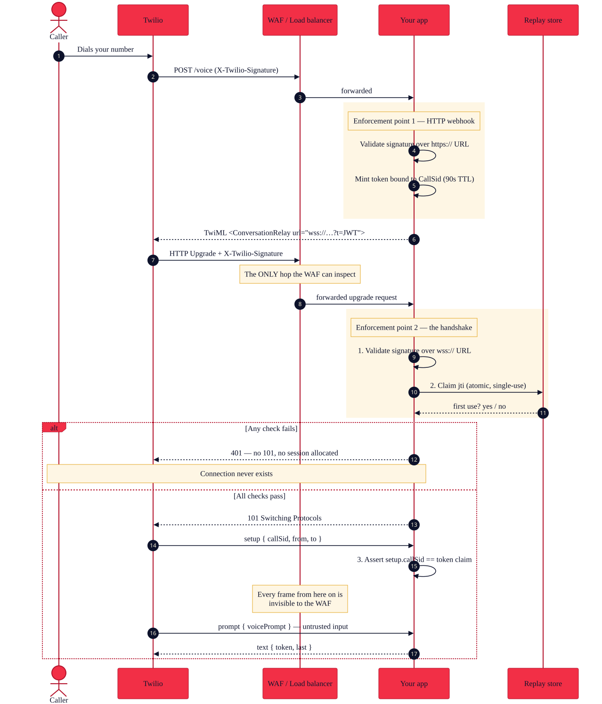

# Securing WebSocket Connections on Twilio

When you build a voice AI agent with [ConversationRelay](https://www.twilio.com/docs/voice/twiml/connect/conversationrelay), you write a `wss://` URL into your TwiML and Twilio connects to it. That URL is on the public internet. Twilio does not tunnel to it, does not connect from a fixed set of IP addresses you can allowlist, and does not authenticate itself unless you make it.

So ask the uncomfortable question: what happens right now if somebody else opens a WebSocket to that URL?

For a lot of deployments the honest answer is "a conversation starts." Your server accepts the socket, waits for a `setup` frame, and begins relaying whatever the peer says into your LLM and back out as text-to-speech. An attacker who guesses or discovers the URL gets a free, anonymous, unmetered channel into your model — your inference bill, your rate limits, your system prompt, and whatever customer context your agent has been built to reach for.

The fix is four layers, and this post walks through all of them with working code. Two are quick. One is the interesting one. And the fourth is the one that silently undoes the other three, because your WAF and your load balancer have opinions about WebSockets that nobody tells you about until calls start dropping at the five-minute mark.

Everything here applies to [Media Streams](https://www.twilio.com/docs/voice/media-streams) too, with one important difference covered near the end.

> **The companion repo:** every snippet below is extracted from a working project with 62 tests and an end-to-end smoke test, plus Terraform for AWS, GCP, and Azure. Grab it at [github.com/bbTwilio/twilio-websocket-security](https://github.com/bbTwilio/twilio-websocket-security).

## Why WebSockets aren't webhooks

Before any of the code, one architectural fact drives every decision in this post.

**A WAF inspects the HTTP upgrade request. It never sees a single WebSocket frame.**

Azure states it plainly in the [Front Door WebSocket docs](https://learn.microsoft.com/azure/frontdoor/standard-premium/websocket): "WAF inspections are applied during the WebSocket establishment phase. After the connection is established, the WAF doesn't perform further inspections." AWS WAF and Google Cloud Armor behave the same way. Once that `101 Switching Protocols` goes back, your edge is a dumb pipe.



That has a hard consequence. Your entire opportunity to decide *whether this connection should exist* is the handshake. After that, every control you have is application code you wrote yourself.

Which means the handshake is worth getting right.

## What you'll need

- A Twilio account with ConversationRelay enabled — access requires onboarding via [Console → Voice → ConversationRelay](https://console.twilio.com/us1/voice/conversation-relay), and it isn't instant
- A voice-capable Twilio phone number
- Node.js 20 or later
- A publicly reachable `wss://` endpoint (a tunnelling service works for local development)

## Layer 1: Transport security

`wss://` is mandatory and Twilio enforces it. Two things to know beyond that.

**Use a real certificate.** Twilio [will not connect to a self-signed certificate](https://www.twilio.com/docs/usage/webhooks/webhooks-security). Let's Encrypt is free and works.

**Terminate TLS 1.2 or better.** Anything older is a finding waiting to happen in your next security review.

That's the whole layer. It buys you confidentiality and integrity on the wire, and it buys you exactly nothing in terms of *who* is connecting. A well-configured TLS endpoint will happily complete a handshake with an attacker.

## Layer 2: Validate the signature on the upgrade request

Here's the part many teams don't realise: **Twilio sends an `X-Twilio-Signature` header on the WebSocket opening handshake**, not just on HTTP webhooks. The [ConversationRelay onboarding guide](https://www.twilio.com/docs/voice/conversationrelay/onboarding) is explicit about it and tells you to check it:

> Extract the `X-Twilio-Signature` header from the incoming WebSocket connection request. Use your Twilio auth token and the request URL to validate this signature. Only accept connections with valid signatures to prevent spoofed requests.

Media Streams does the same — the [Media Streams firewall documentation](https://www.twilio.com/docs/global-infrastructure/firewall-configurations/media-streams-configuration) says to configure your application to validate the header, because that is how you confirm a stream is "coming from an authentic Twilio source."

### The gotcha that will cost you an afternoon

Twilio signs the URL **exactly as you wrote it in the TwiML `url` attribute**. For a WebSocket, that string starts with `wss://`.

Almost everybody hits this, because almost everybody copies their existing webhook validation helper, and that helper normalises to `https://`. The result is a signature that never matches:

```ts
// ❌ WRONG — this is webhook code, and it will reject every upgrade request
const url = `https://${host}${req.url}`;

// ✅ RIGHT — Twilio signed the wss:// string from your TwiML
const url = `wss://${host}${req.url}`;
```

The failure mode is genuinely nasty. Your handler returns 403, Twilio logs [error 64102 — "Unable to Connect to Websocket URL"](https://www.twilio.com/docs/api/errors/64102), whose documented causes are a typo in the URL, no server at the URL, or a server that "is not responding correctly." None of those say "your signature check is wrong." Meanwhile the caller hears silence and hangs up.

Here's validation done properly:

```ts
import twilio from 'twilio';

// `twilio` is CommonJS — validateRequest lives on the default export only.
const { validateRequest } = twilio;

export function validateTwilioUpgrade({ signature, signedUrl, authTokens }) {
  if (typeof signature !== 'string' || signature.length === 0) return false;

  const tokens = authTokens.filter(Boolean);
  if (tokens.length === 0) {
    throw new Error('No Twilio auth token configured; cannot validate signatures.');
  }

  // Evaluate every token rather than short-circuiting, so acceptance timing
  // doesn't leak which one matched.
  let ok = false;
  for (const token of tokens) {
    if (validateRequest(token, signature, signedUrl, {})) ok = true;
  }
  return ok;
}
```

Three details worth calling out:

**The params argument is `{}` on purpose.** There's no form body on an upgrade request, and any query string is already part of `signedUrl`. Passing the query as params *as well* folds it into the HMAC twice, and it will never match.

**Pass an array of auth tokens.** Rotating your Twilio auth token invalidates in-flight signatures. Validate against both the primary and secondary token during the rotation window, or you'll drop live calls to save one line of code.

**Never build the signed URL from the inbound `Host` header.** That header is attacker-controlled, and the host is part of what Twilio signs. Letting a caller choose the string you sign means letting them choose which signature you'll accept. Configure the origin explicitly.

### Where Layer 2 stops

Signature validation proves a request came from someone holding your auth token. That's a lot. But notice what it doesn't prove.

The signature is an HMAC over a **static string** — your `wss://` URL never changes, so the signature never changes. It's byte-identical on every call your application ever receives. Anyone who captures it once, from a proxy log, an APM trace, a screenshot pasted into a support ticket, can replay it forever.

That's the gap Layer 3 closes.

## Layer 3: A short-lived token bound to the call

The idea is simple. Your voice webhook already runs before the WebSocket connects, and Twilio has just told you the `CallSid`. So mint a token there, bind it to that call, give it a ninety-second life, and let it be redeemed exactly once.

### Put it in the URL, not in a `<Parameter>`

ConversationRelay supports [`<Parameter>` child elements](https://www.twilio.com/docs/voice/twiml/connect/conversationrelay) whose values arrive in the `setup` message as `customParameters`. That is the documented way to pass custom data, and it's tempting for this.

Don't use it for authentication. `setup` arrives **after** the handshake has completed. By the time you can read it you have already returned `101`, allocated a session, and put a socket on your event loop. The best you can do is accept-then-close.

Put the token in the URL instead and it arrives on the upgrade request, where you can refuse the handshake outright. As a bonus, it's covered by the Twilio signature automatically, because Twilio signs the whole URL.

```ts
app.post('/voice', express.urlencoded({ extended: false }), async (req, res) => {
  // Ordinary webhook validation — note the https:// scheme here. This really
  // is an HTTP request. The wss:// exception applies to the upgrade only.
  const url = `https://${PUBLIC_HOST}${req.originalUrl}`;
  const ok = AUTH_TOKENS.some((t) =>
    t && twilio.validateRequest(t, req.header('X-Twilio-Signature') ?? '', url, req.body),
  );
  if (!ok) return res.status(403).send('Forbidden');

  // Twilio has just handed us the CallSid, so bind the token to this one call.
  const { token } = await mintRelayToken({
    callSid: req.body.CallSid,
    accountSid: req.body.AccountSid,
    secret: TOKEN_SECRET,
    ttlSeconds: 90,
  });

  const response = new twilio.twiml.VoiceResponse();
  response.connect().conversationRelay({
    url: buildRelayUrl(`wss://${PUBLIC_HOST}/ws`, token), // wss://…/ws?t=<JWT>
    welcomeGreeting: 'Hello! How can I help you today?',
  });

  res.type('text/xml').send(response.toString());
});
```

The token itself is an HS256 JWT with a `jti`, an audience, an issuer, and a tight expiry:

```ts
const token = await new SignJWT({ callSid, accountSid })
  .setProtectedHeader({ alg: 'HS256', typ: 'JWT' })
  .setIssuer('urn:twilio-relay:voice-webhook')
  .setAudience('urn:twilio-relay:websocket')
  .setIssuedAt(now)
  .setNotBefore(now)
  .setExpirationTime(now + 90)
  .setJti(randomUUID())
  .sign(secret);
```

Use a secret that is yours, not your Twilio auth token. Thirty-two bytes minimum, from `openssl rand -base64 32`. Keeping them separate means you can rotate this one without touching Twilio, and a leaked auth token doesn't also let someone mint connection tokens.

### Verify before the 101

This is the shape that matters, and it's why the sample uses `ws` with `noServer: true`. If you write `new WebSocketServer({ server })`, the library attaches its own upgrade listener and completes the handshake for you — leaving you to accept-then-close, exactly what we're trying to avoid. A manual handler keeps the decision in your hands:

```ts
const wss = new WebSocketServer({ noServer: true, maxPayload: 256 * 1024 });

server.on('upgrade', (req, socket, head) => {
  socket.setTimeout(SETUP_TIMEOUT_MS); // don't let a silent socket hold a slot

  void (async () => {
    const deny = (reason, code = 401, status = '401 Unauthorized') => {
      // One identical response for every failure. Telling the caller whether
      // the signature or the token was wrong hands them a free oracle.
      console.warn(JSON.stringify({ event: 'upgrade_rejected', reason }));
      socket.write(`HTTP/1.1 ${status}\r\nConnection: close\r\n\r\n`);
      socket.destroy();
    };

    const result = await authenticateUpgrade(
      { requestTarget: req.url ?? '/', headers: req.headers },
      { publicOrigin: `wss://${PUBLIC_HOST}`, twilioAuthTokens, tokenSecret, jtiStore },
    );

    if (!result.ok) return deny(result.reason);

    // Only now does a WebSocket come into existence.
    wss.handleUpgrade(req, socket, head, (ws) => {
      socket.setTimeout(0);
      attachRelayHandlers(ws, result.claims);
    });
  })();
});
```

The order inside `authenticateUpgrade` is deliberate:

1. **Signature first.** It's a cheap local HMAC with no I/O, and it's the check that establishes "Twilio sent this." Everything after it depends on that being true.
2. **Token second.** Proves this handshake belongs to a call your own webhook set up moments ago.
3. **Burn the `jti` last.** Only authenticated requests get to write to the replay store. Reverse this and an attacker floods your Redis instead of your app.

### Single use, atomically

Replay protection is one atomic "claim this ID, tell me if I'm first" operation. Never read-then-write: two upgrade requests carrying the same token can land on two instances in the same millisecond, and a read-then-write lets both through.

```ts
// Redis: SET..NX..EX is one round trip and exactly one caller sees 'OK'
const result = await redis.set(`relay:jti:${jti}`, '1', 'EX', ttlSeconds, 'NX');
return result === 'OK';
```

```ts
// DynamoDB: the conditional put failing IS the replay signal
try {
  await client.send(new PutCommand({
    TableName: tableName,
    Item: { jti, expiresAt: Math.floor(Date.now() / 1000) + ttlSeconds },
    ConditionExpression: 'attribute_not_exists(#k)',
    ExpressionAttributeNames: { '#k': 'jti' },
  }));
  return true;
} catch (err) {
  if (err.name === 'ConditionalCheckFailedException') return false;
  throw err; // a table outage must fail CLOSED, not open
}
```

An in-memory `Map` is fine for local development and useless in production: each instance keeps its own, so a replay just routes to the other one and succeeds.

### Then check the `setup` frame

Binding the token to a `CallSid` only means something if you compare it to what arrives:

```ts
if (!callSidMatches(claims, event.callSid)) {
  return ws.close(1008, 'call mismatch'); // 1008 = policy violation
}
```

Without this, a token minted for one call could open a socket and then drive a conversation attributed to another.

### Optional: confirm the call is real

For regulated or high-value flows, add one more check — ask Twilio whether the call actually exists:

```ts
const call = await client.calls(claims.callSid).fetch();
if (call.accountSid !== EXPECTED_ACCOUNT_SID) return ws.close(1008);
if (!['queued', 'ringing', 'in-progress'].includes(call.status)) return ws.close(1008);
```

This costs a REST round trip on every connection, so decide deliberately rather than switching it on by reflex. Also decide what happens when Twilio itself is rate-limiting you: failing closed is safer but drops live calls during an API blip, and failing open loses the check exactly when someone might be causing the errors. Pick per workload, but pick.



## Layer 4: Your WAF and your load balancer

Now the layer that breaks the other three.

### You cannot allowlist Twilio's IP addresses

Start here, because it's the first thing every security team asks for. Twilio's [Media Streams firewall documentation](https://www.twilio.com/docs/global-infrastructure/firewall-configurations/media-streams-configuration) tells you to permit connections "from Twilio to your WebSocket servers from any public IP address," and the [webhook security guide](https://www.twilio.com/docs/usage/webhooks/webhooks-security) explains why: Twilio runs on cloud infrastructure and does "not have a fixed range of IP addresses."

So your security group is `0.0.0.0/0` on port 443, deliberately, and authentication happens in the application. That isn't a shortcut — it's the design. Write it down for your auditor before they find it themselves.



### Four invariants, everywhere

1. **Don't cache the upgrade route.**
2. **Forward the `Upgrade` and `Connection` headers.**
3. **Raise your idle timeout, and send application-level pings.**
4. **Rate-limit the upgrade path** — one connection is one request here, so a threshold that would be absurd for a web page is exactly right.

That third one deserves emphasis. A caller placed on hold sends nothing. Your bot sends nothing. To an edge proxy, a perfectly healthy call is indistinguishable from a dead connection. Ping every 20–30 seconds:

```ts
let alive = true;
const heartbeat = setInterval(() => {
  if (!alive) return ws.terminate();
  alive = false;
  ws.ping();
}, 25_000);
ws.on('pong', () => { alive = true; });
```

### AWS

**Rate-limit the handshake.** A rate-based rule scoped to your WebSocket path is the single most useful rule you can write:

```hcl
rule {
  name     = "rate-limit-upgrade"
  priority = 1
  action { block {} }

  statement {
    rate_based_statement {
      limit              = 100  # per 5-minute window, per IP
      aggregate_key_type = "IP"

      scope_down_statement {
        byte_match_statement {
          search_string         = "/ws"
          positional_constraint = "STARTS_WITH"

          field_to_match {
            uri_path {}
          }

          text_transformation {
            priority = 0
            type     = "LOWERCASE"
          }
        }
      }
    }
  }
}
```

**Managed rules false-positive on handshakes.** A ConversationRelay upgrade is an odd-looking GET: `Upgrade`/`Connection` headers, no body, no `User-Agent`, and a long base64url JWT in the query string. `AWSManagedRulesCommonRuleSet` flags exactly that shape — usually `SizeRestrictions_QUERYSTRING`, `GenericRFI_QUERYARGUMENTS`, `NoUserAgent_HEADER`, or `CrossSiteScripting_QUERYARGUMENTS`. Scope the managed group away from the upgrade path; that request carries no user input beyond a token you cryptographically verify yourself, so there's little there for signature rules to protect.

**If you're on an ALB, raise `idle_timeout`.** It defaults to 60 seconds. The maximum is 4000.

**If you're on API Gateway WebSocket APIs**, a `$connect` Lambda authorizer is genuinely the cleanest enforcement point on any cloud — it [receives both headers and query string parameters](https://docs.aws.amazon.com/apigateway/latest/developerguide/apigateway-websocket-api-lambda-auth.html), and a deny produces a bare `401` with no connection at all. But two things will bite you.

First, **the trap in this whole post**:

```yaml
ConnectAuthorizer:
  Type: AWS::ApiGatewayV2::Authorizer
  Properties:
    AuthorizerType: REQUEST
    # API Gateway caches authorizer decisions keyed on identity sources.
    # Leave caching on and a replayed token inside the cache window returns
    # the cached ALLOW *without invoking your authorizer at all* — your
    # single-use check silently never runs.
    AuthorizerResultTtlInSeconds: 0
    IdentitySource:
      - route.request.header.X-Twilio-Signature
      - route.request.querystring.t
```

Second, [API Gateway's WebSocket quotas](https://docs.aws.amazon.com/apigateway/latest/developerguide/apigateway-execution-service-websocket-limits-table.html) include a **10-minute idle timeout and a 2-hour maximum connection duration, neither adjustable**. If you take calls longer than two hours, this is the wrong platform. And because every frame is a separate invocation, session state — including the verified `CallSid` — has to live in DynamoDB.

### Google Cloud

GCP needs no configuration to proxy WebSockets. What it needs is timeout attention, and **there are two separate timeouts that will each independently kill your calls.**

**Cloud Run's request timeout.** A WebSocket on Cloud Run is a long-running HTTP request, so it cannot outlive the service timeout — which [defaults to five minutes](https://docs.cloud.google.com/run/docs/triggering/websockets) and caps at sixty. Miss this and every call past the five-minute mark dies mid-sentence with nothing in your logs resembling an error:

```bash
gcloud run deploy twilio-relay \
  --source . \
  --timeout 3600 \
  --session-affinity \
  --min-instances 1 \
  --set-secrets "TWILIO_AUTH_TOKEN=twilio-auth-token:latest,RELAY_TOKEN_SECRET=relay-token-secret:latest"
```

Note there's no Dockerfile: `--source` builds the image with buildpacks. Also note `--min-instances 1`, which avoids a cold start on the upgrade request, and **do not** enable end-to-end HTTP/2 — it breaks the upgrade.

**The backend service timeout**, if you front Cloud Run with a load balancer. It defaults to **30 seconds**. Raise it to 3600. Google's documented semantics for how this interacts with WebSockets have differed between load balancer generations, so rather than depend on which reading applies to your setup, do both: raise the timeout *and* send pings, which is correct either way.

**Session affinity is best-effort only.** Requests can still land on different instances, which is precisely why single-use token enforcement needs Memorystore rather than a local `Map` once you scale past one instance.

For Cloud Armor, rate-limit the upgrade path and start the preconfigured WAF rules in preview mode — the base64url JWT reliably trips the XSS and SQLi signature sets:

```hcl
rule {
  action   = "throttle"
  priority = 1000

  match {
    expr { expression = "request.path.startsWith('/ws')" }
  }

  rate_limit_options {
    conform_action = "allow"
    exceed_action  = "deny(429)"
    enforce_on_key = "IP"

    rate_limit_threshold {
      count        = 100
      interval_sec = 300
    }
  }
}
```

### Azure

Front Door Standard and Premium both support WebSockets with no extra configuration, and Azure has the sharpest edge of the three clouds. It is also a silent one.

**Do not enable caching on the WebSocket route.** From [Microsoft's own docs](https://learn.microsoft.com/azure/frontdoor/standard-premium/websocket): for routes with caching enabled, "Azure Front Door doesn't forward the WebSocket Upgrade header to the origin and treats it as an HTTP request, disregarding cache rules. This behavior results in a failed WebSocket upgrade request."

Enabling caching doesn't slow your WebSocket down. It stops it existing. Your server sees an ordinary GET, never returns a 101, and Twilio reports error 64102. Nothing in the Front Door metrics says "caching broke your WebSocket."

Front Door's **5-minute idle timeout and 2-hour maximum are both fixed** — you cannot raise them, which makes application-level pings mandatory rather than advisable. Each profile also caps at 3,000 concurrent connections. If those limits don't fit, Application Gateway v2 also supports WebSockets with a configurable backend timeout, trading global anycast for control.

### Platform comparison

| Platform | WebSocket | WAF inspects | Idle timeout | Max duration |
|---|---|---|---|---|
| AWS ALB | Yes | Upgrade only | 60s → **4000s** | None |
| AWS API Gateway (WS) | Yes | Upgrade only | **10 min, fixed** | **2 h, fixed** |
| AWS CloudFront | Yes | Upgrade only | Origin-governed | None |
| GCP Cloud Run | Yes | n/a | **5 min → 60 min** | 60 min |
| GCP App Load Balancer | Yes | Upgrade only | 30s → **3600s** | 24 h |
| Azure Front Door | Yes | Upgrade only | **5 min, fixed** | **2 h, fixed** |
| Azure App Gateway v2 | Yes | Upgrade only | Configurable | — |
| Cloudflare | Yes | Upgrade only | ~100s idle | — |

Bold values are the ones you must change or design around.

## Media Streams: same handshake, one important difference

Everything above applies to `<Connect><Stream>` and `<Start><Stream>`, with one exception that matters.

**Media Streams does not support query strings.** Twilio's [error 31920 documentation](https://www.twilio.com/docs/api/errors/31920) is explicit: `<Stream>` does not support them, and the recommended fix is to strip them and pass custom values via nested `<Parameter>` nouns instead.

That breaks the query-string token from Layer 3. But you don't have to fall back to `<Parameter>` and give up pre-accept rejection — put the token in a **path segment** instead:

```ts
// wss://relay.example.com/stream/<token>
const relayUrl = buildRelayPathUrl(`wss://${PUBLIC_HOST}/stream`, token);
```

It still arrives on the upgrade request, so you keep the ability to refuse the handshake, and it's still covered by the signature because Twilio signs the entire URL. It's also a perfectly good pattern for ConversationRelay if you'd rather run one approach for both products.

The other differences are cosmetic: signature validation is identical, and custom parameters arrive in the `start` message as `start.customParameters` rather than in `setup`.

## What each layer actually stops

| Threat | Stopped by |
|---|---|
| Scanner opens a socket to your URL | Signature validation |
| Replay of a captured signature | Short-lived token |
| Token reused on a different call | `CallSid` binding |
| Token reused on the same call | Single-use `jti` |
| Forged `setup` frame | REST cross-check *(optional)* |
| Handshake flood | WAF rate limiting |
| Frame-level injection | **Application code only — no WAF can see frames** |

That last row is the point. Everything after the handshake is on you.

## Two things that aren't the handshake

**Treat `voicePrompt` as untrusted input.** It's transcribed caller speech, and anyone who reaches your bot can say anything into it. Pass it to your LLM as user-role content inside a structured prompt, never concatenated into your system instructions, and filter the output — whatever the model returns is spoken to the caller verbatim. ConversationRelay is a transport layer with no built-in content safety.

**Query strings end up in logs.** ALB access logs, CloudFront logs, Cloud Logging and Front Door diagnostics all record the full query string, which means they record your token. A 90-second credential in a log file is a mild problem; the same credential in a log bucket your whole org can read is a worse one. Redact at the edge and in your own logging, and remember that transcripts are personal data too. Twilio also notes that `<Parameter>` values and `welcomeGreeting` are **not** treated as PCI data, so keep card data out of both.

## Testing it

Negative tests are the ones that matter here, because a broken security layer looks exactly like a working one until someone probes it. From the companion repo:

```
--- Layer 2: signature validation ---
PASS  anonymous upgrade is refused
PASS  upgrade with a bogus signature is refused
PASS  signature computed over https:// is refused (the scheme gotcha)

--- Layer 3: token, binding, replay ---
PASS  correctly signed + tokened upgrade succeeds  (got 101)
PASS  replaying the same token is refused  (got 401)

--- setup frame: CallSid binding ---
PASS  mismatched CallSid in setup closes the socket  (close code 1008)
```

The quickest manual check — this must fail:

```bash
npx wscat -c wss://your-host.example.com/ws
# expected: error: Unexpected server response: 401
```

If that connects, you have work to do. And keep a regression test on the `https://`-versus-`wss://` scheme, because it's the kind of thing a well-meaning refactor "cleans up."

## What's next

The four layers, in the order to build them:

1. **`wss://` with a real certificate.** Non-negotiable, and Twilio enforces it.
2. **Validate `X-Twilio-Signature` on the upgrade** — remembering the `wss://` scheme, and validating against both auth tokens while rotating.
3. **Add a short-lived, single-use token bound to the `CallSid`**, in the query string for ConversationRelay or a path segment for Media Streams, and cross-check it against the `setup` frame.
4. **Configure your edge** so it doesn't cache the upgrade route, doesn't strip the `Upgrade` header, and doesn't time out a call that's merely on hold.

Layers 1 and 2 are table stakes. Layer 3 is what turns a replayable static signature into a credential that's useful once, for ninety seconds, for one specific call. Layer 4 is what keeps the first three from being quietly undone by a default you never chose.

The full working implementation, with tests and Terraform for all three clouds, is at [github.com/bbTwilio/twilio-websocket-security](https://github.com/bbTwilio/twilio-websocket-security).

Go build something, and make it refuse strangers.
